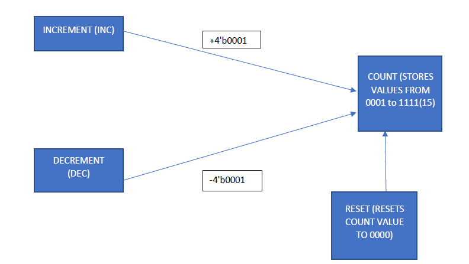
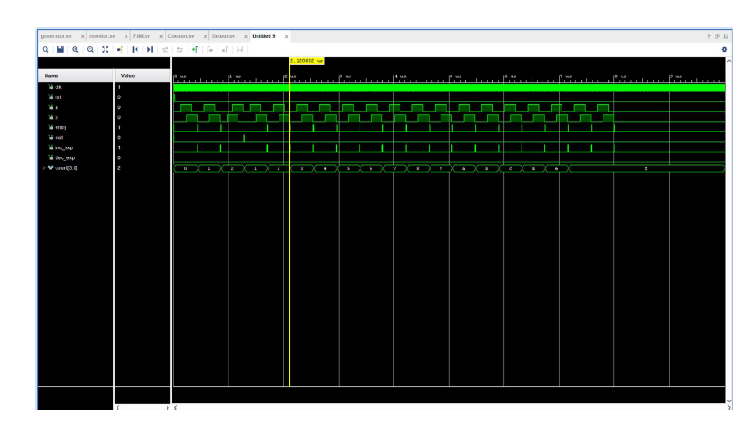

# Car-Parking-System-Testbench-Verilog
Comprehensive automatic Test bench for a car park system implemented on PYNQ FPGA Board

This code was developed for purely academic purposes by (ADG4050) as part of the module of Integrated systems design (EE5M01) in Trinity College Dublin

## PYNQ FPGA BOARD 

PYNQ is an open-source project from Xilinx which integrates software and hardware components for faster development using Zynq devices. PYNQ combines the Python language with FPGA-based Programmable Logic (PL) and an Arm-based Processing System (PS) for building electronic systems. We’ll be using PYNQ-Z2 boards for this lab, however the PYNQ software framework can be run on other development boards as well. The PYNQ framework allows for user interaction through Jupyter Notebooks. ‘Notebooks’ are interactive documents containing live executable code organized into cells. PYNQ’s Jupyter Notebooks are hosted on the Zynq’s Arm processor and we can access them using a web browser (so long as the PYNQ board and the PC with the web browser are connected to the same network).

## Car Park System (The problem in hand)

Consider a carpark with a single entry and exit gate. Two pairs of photo sensors are used to monitor the activity of cars, as shown in Figure 5.11 of the Chu book, reproduced in Figure 1 above. When an object is between the photo transmitter and the photo receiver, the light is blocked and the corresponding output is asserted to 1. By monitoring the inputs from two sensors, we can determine whether a car is entering or exiting. For example, the following sequence indicates that a car enters the carpark:

• Initially, both sensors are unblocked (input from sensors a and b is “00”).

• Sensor a is blocked (input “10”).

• Both sensors are blocked (input “11”).

• Sensor a is unblocked (input “01”).

• Both sensors become unblocked (input “00”).

You need to design a carpark occupancy counter for a carpark of 15 spaces.

## Solution (FSM, Counter and Top Module Design)

**INTRODUCTION**

The FSM design consists of three modules the FSM, the counter and the top module which instantiates both.

**Counter Block Design (Procedure)** 

The counter is designed with three inputs (reset, increment & decrement), one clock signal and one output count which also acts as a register. Once the increment is high, the count value increases by 1 until it reaches 15(1111) which is the highest capacity. Similarly, once the decrement is high, the count value decreases by 1 until it reaches 0. The increment and decrement bit goes into operation only on the positive edge of the clock. Reset resets the count value to 0000.

**Counter Block TB (Observation)**
The testbench is created with reset triggering after every 40 units and clock triggering at every 2 units. The increment is triggered for 10 units for 4 loops resulting in the count value 4. Upon reset signal, the value resets to zero. The decrement is next triggered to check the overflow condition and results with count value being 0.

**FSM DESIGN (PROCEDURE)**

The FSM Design consists of 6 states (P,Q,R,S,En,Er). Sensor inputs A & B together are used for transition between the current and next states. A reset button is used to reset the state to A. For the entry sequence the following sequence is to be obtained in the state machine P<->Q<->S<->R<->En. If A is high & B is low, then we transit from state P to Q. From Q if both A & B are high, then we transit to state S. From S, if A is low and B is high, we transit to R. From R, if both A & B are low, we transit to state En, which depicts that the car has entered. Similarly for exit scenario P<->R<->S<->Q<->Ex, is to be maintained. Upon Ex and En bits being high, outputs Entry and Exit are high to affect the counter value.

**FSM TB (OBSERVATION)**

The testbench is created with reset initially being high till 30 units and then getting low. The positive edge of the clock triggers every 5 units. The entry sequence is simulated twice to check whether entry bit goes high twice and exit sequence is simulated to check the exit bit.

**CONCLUSION**

After top module creation, and adding debouncer module, the top module was synthesized, design implemented and bitstream was generated. The bitstream file was uploaded to the PNNQ module and tested. Four LEDs as output and three buttons (one for reset, one for A, one for B) were used from the constraint file. The counter value counted to 15(1111), upon entry sequence and counted to 0000 upon exit sequence.

## ADVANCED TESTBENCH (UNIVERSAL VERIFICATION METHODOLOGY)

**The Generator Module**

The generator module has four outputs (a, b, rst, clr) which link with the overall testbench and similarly two outputs (inc_exp, dec_exp) linking to the monitor module. It majorly consists of three tasks, the counter reset task which resets the counter after 25 ns, the initialize task which initiates the reset counter and initializes the (a, b, inc_exp, dec_exp) bits. Also, most importantly the counter task, which has all the FSM scenarios listed to achieve the sequences required for the counter to work. Overall, it is an abstract procedure generating test vectors and sequencing the clock as per requirement. Below are the screen shots of various tasks used in the generator module.

**The Monitor Module**

The Monitor module goes through all the activates of the counter, records it, compares and cross verifies its operation. It also displays error and success messages based on the code verification. Below is the code displaying the error & success scenarios. It takes 4 inputs from the generator module and a single input count from the FSM module.

**Details of scenario tested**

The following scenarios were tested through the test bench
i) Entry & Counter up scenario: The entry scenario follows the FSM sequence P<->Q<->S<->R<->En, upon this sequence detection the entry bit goes high and counter counts +4b’0001.
ii) Exit & Counter down scenario: The exit scenario follows the FSM sequence P<->R<->S<->Q<->Ex, upon this sequence detection the exit bit goes high and the counter counts -4b’0001.
iii) Overflow condition 1: The counter has 4 bits, so it can count to 15(1111) as per specifications. After 1111, the counter stays at 1111 regardless of the entry bit going high and displays an error.
iv) Overflow condition 2: The counter cannot count down below 0000. Below 0000, the counter stays at 0000 regardless of the exit bit going high and displays an error.
v) Wrong Sequence: The entry and exit bit goes high depending on a certain scenario as per the FSM states. Any wrong sequence leads to FSM state being held and not moving forward and displaying an error.

**Documentation of bugs found**

The test bench has recorded the following bugs based on the tested scenarios
a) Overflow condition (Intentional): - Any counter increment after count value 1111, the log of the counter shows ERROR. This is the overflow condition applied in the entry condition of counting. (i.e.) if (entry ==1) && (count <=15), then increment count otherwise count = 1111. 
b) Wrong sequence (intentional): - A wrong sequence was entered to check the count value, with counter value remaining same though and an error message is to be displayed. Error successfully obtained in the log.
c) Reset Scenario(intentional): - Initially 25ns were meant to reset with count value being 0000. The reset scenario started from the first negative edge, leaving the count value X for the first pulse. 
d) Log Values restart error(unintentional): - The log values tend to show error if state X is being displayed in a waveform. 
e) Log Values inc_exp and dec_exp error (unintentional): - The log values show error when inc_exp or dec_exp bits are high but does not correspond 100% with the entry or exit signal. This is because inc_exp and dec_exp happen simultaneously only when last a = 0, b = 0 in the FSM sequence. 

**Screen Captures - Timing Diagram & Log Files**

